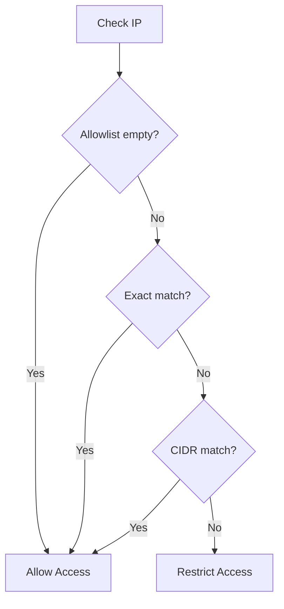

# Eligibility System

The eligibility system controls access to organizations and workspaces based on IP allowlists and MFA requirements. This centralized system ensures consistent security enforcement across your deployment.

## Overview

When users attempt to access an organization or workspace, the system checks:

1. **IP Restrictions** - Whether the user's IP is in the allowlist
2. **MFA Requirements** - Whether the user has set up multi-factor authentication

These checks can be configured independently for organizations and workspaces.

## Restriction Types

The system returns one of the following restriction types:

| Type | Description |
|------|-------------|
| `none` | No restrictions - user can access |
| `ip_not_allowed` | User's IP address is not in the allowlist |
| `mfa_required` | User has not set up MFA |
| `ip_and_mfa_required` | Both IP and MFA restrictions apply |

## Admin Bypass

Users with the following permissions bypass eligibility checks:

| Context | Bypass Permission |
|---------|-------------------|
| Organization | `organization:admin` |
| Workspace | `workspace:admin` or `organization:admin` |

Admin users can always access their organizations and workspaces regardless of IP or MFA restrictions.

## IP Allowlists

### Enabling IP Restrictions

IP restrictions can be enabled at two levels:

1. **Organization level**: `enable_ip_restriction` on the organization
2. **Workspace level**: `enable_ip_restriction` on the workspace

Both require the corresponding deployment-level feature flags to be enabled:
- `ip_allowlist_per_org_enabled`
- `ip_allowlist_per_workspace_enabled`

### CIDR Notation Support

IP allowlists support CIDR notation for defining IP ranges:

```
# Single IPs
192.168.1.100
10.0.0.50

# IP ranges using CIDR
192.168.1.0/24    # 192.168.1.0 - 192.168.1.255
10.0.0.0/8        # 10.0.0.0 - 10.255.255.255
172.16.0.0/12     # 172.16.0.0 - 172.31.255.255
```

### IP Check Logic



## MFA Requirements

### Enabling MFA Enforcement

MFA requirements can be enabled at two levels:

1. **Organization level**: `enforce_mfa_setup` on the organization
2. **Workspace level**: `enforce_mfa_setup` on the workspace

Both require the corresponding deployment-level feature flags:
- `enforce_mfa_per_org_enabled`
- `enforce_mfa_per_workspace_enabled`

### MFA Check Logic

A user is considered to have MFA set up if:
- They have a registered authenticator (`user_authenticator` is set), OR
- They have generated backup codes (`backup_codes_generated` is true)

## API Response

When eligibility restrictions apply, API responses include the restriction details:

```json
{
  "eligibility_restriction": {
    "type": "mfa_required",
    "message": "You must set up Multi-Factor Authentication to access this organization."
  }
}
```

### Response Fields

| Field | Type | Description |
|-------|------|-------------|
| `type` | string | Restriction type (see table above) |
| `message` | string | Human-readable message for the user |

## Frontend Integration

### SDK Hooks

The SDK provides eligibility information through various hooks:

```typescript
// Organization memberships include eligibility info
const { data } = useOrganizationMemberships();
// data[].eligibility_restriction

// Workspace list includes eligibility info
const { data } = useWorkspaceList();
// data[].eligibility_restriction
```

### Handling Restrictions

When a restriction is present, you should:

1. Display the `message` to the user
2. Guide them to resolve the issue:
   - For `ip_not_allowed`: Contact admin to update allowlist
   - For `mfa_required`: Redirect to MFA setup
   - For `ip_and_mfa_required`: Address both issues

### Switch Organization/Workspace

When calling switch endpoints, a 403 response indicates eligibility failure:

```json
{
  "error": "You must set up Multi-Factor Authentication to access this organization."
}
```

## Configuration

### Deployment Settings

Enable eligibility features in your deployment B2B settings:

```yaml
b2b_settings:
  ip_allowlist_per_org_enabled: true
  ip_allowlist_per_workspace_enabled: true
  enforce_mfa_per_org_enabled: true
  enforce_mfa_per_workspace_enabled: true
```

### Organization/Workspace Settings

Configure individual organizations and workspaces:

```yaml
# Organization
enable_ip_restriction: true
whitelisted_ips: ["192.168.1.0/24", "10.0.0.100"]
enforce_mfa_setup: true

# Workspace
enable_ip_restriction: true
whitelisted_ips: ["192.168.2.0/24"]
enforce_mfa_setup: false
```

## Best Practices

1. **Test IP ranges** - Verify CIDR ranges before deploying to production
2. **Admin fallback** - Ensure at least one admin can bypass restrictions
3. **Gradual rollout** - Enable restrictions per organization/workspace, not deployment-wide
4. **User communication** - Notify users before enforcing MFA requirements
5. **Backup codes** - Encourage users to generate backup codes as an MFA backup
