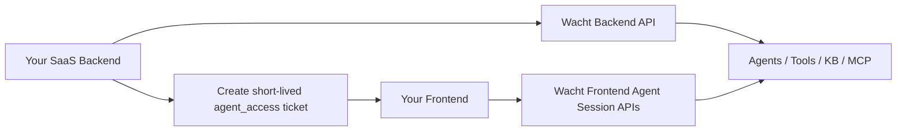

# Build AI Agents in Your SaaS

If you are adding AI agents to a production SaaS, treat this as two separate concerns:

1. Agent control plane: how your team configures agents, tools, knowledge, and MCP servers.
2. Agent runtime plane: how your users actually chat with agents inside your product.

Wacht supports both planes with Console-first and API-first patterns.

## Choose your implementation model

### Model 1: Console-first

Use this when you want the fastest rollout.

1. Configure agents, tools, knowledge bases, and MCP servers in Console.
2. Generate session tickets from your backend.
3. Open Wacht vanity agent UI (`/vanity/agents?ticket=...`) or mount custom chat using frontend hooks.

Best for:

1. Teams shipping first version quickly.
2. Ops-heavy teams that want non-engineers to manage agent config.
3. Cases where you want strong defaults before heavy customization.

### Model 2: API-first

Use this when agent setup must be automated per tenant or per workflow.

1. Create and update agents with backend SDK methods (`client.ai.createAgent`, `client.ai.createExecutionContext`).
2. Manage MCP servers through SDK HTTP helpers (`client.post/get/delete`) against `/ai/mcp-servers`, then attach per agent.
3. Run contexts from your app with tickets and frontend hooks.

Best for:

1. Multi-tenant SaaS onboarding automation.
2. Dynamic agent provisioning.
3. Strict internal policies around infra-as-code.

### Model 3: Hybrid (recommended)

Most teams should combine both:

1. Bootstrap in Console.
2. Automate repetitive setup via Backend API.
3. Keep runtime UX inside your product with hooks.

## Architecture in practice

## What you will implement in this guide set

1. Create and run agents using Console + Backend API.
2. Embed agent runtime in your app using session tickets and frontend hooks.
3. Connect MCP servers and attach them to agents.
4. Protect MCP servers with OAuth app token verification.

## Related references

1. [Backend AI API Reference](/backend-api/agents)
2. [Node SDK AI API](/node-sdk/api/ai)
3. [Node SDK Gateway Authz](/node-sdk/auth/gateway)
4. [Frontend Agent APIs](/frontend-api/agents)
