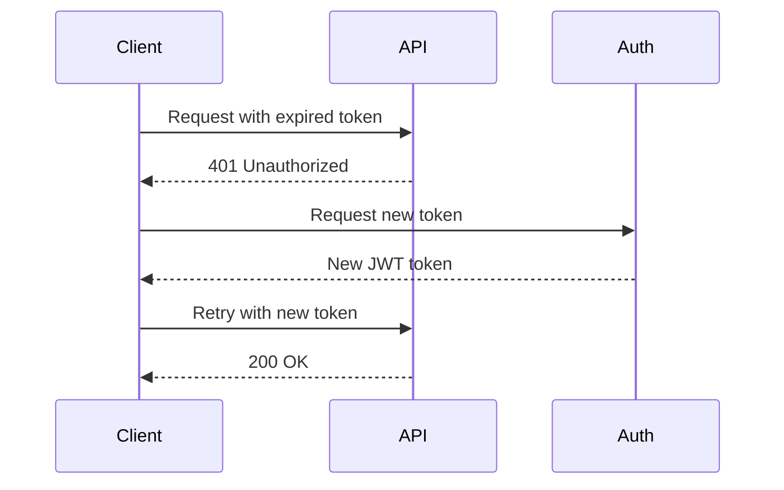
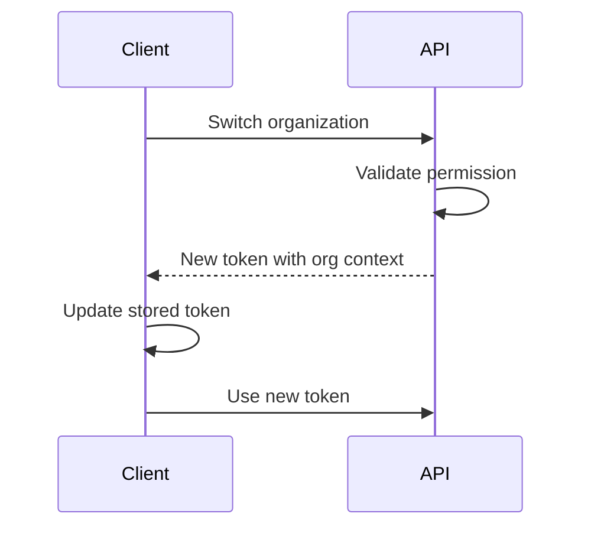

## Overview

Wacht JWT tokens contain claims that identify the user, their session, and their permissions within organizations and workspaces. Understanding these claims is essential for implementing proper authorization in your application.

## Token Structure

### Standard Claims

```rust
#[derive(Debug, Clone, Serialize, Deserialize)]
pub struct TokenClaims {
    /// Issuer - identifies token source
    pub iss: String,

    /// Subject - user ID
    pub sub: String,

    /// Issued At - Unix timestamp
    pub iat: i64,

    /// Expiration - Unix timestamp
    pub exp: i64,

    /// Session ID - unique session identifier
    pub session_id: String,

    /// Organization context (optional)
    pub organization: Option<String>,

    /// Organization permissions (optional)
    pub organization_permissions: Option<Vec<String>>,

    /// Workspace context (optional)
    pub workspace: Option<String>,

    /// Workspace permissions (optional)
    pub workspace_permissions: Option<Vec<String>>,

    /// Additional custom claims
    #[serde(flatten)]
    pub custom_claims: serde_json::Map<String, serde_json::Value>,
}
```

## Claim Descriptions

### Core Claims

<ParamField path="iss" type="string">
  Token issuer, typically your Wacht deployment URL (e.g., "https://app.wacht.io")
</ParamField>

<ParamField path="sub" type="string">
  Subject identifier - the user's unique ID in the system
</ParamField>

<ParamField path="iat" type="i64">
  Issued at time as Unix timestamp. Used to determine token age.
</ParamField>

<ParamField path="exp" type="i64">
  Expiration time as Unix timestamp. Token is invalid after this time.
</ParamField>

<ParamField path="session_id" type="string">
  Unique identifier for the user's session. Used for session management and revocation.
</ParamField>

### Organization Claims

<ParamField path="organization" type="string | null">
  Current organization ID if user has switched to an organization context
</ParamField>

<ParamField path="organization_permissions" type="string[] | null">
  List of permissions the user has within the organization. Examples:
  - `users:read` - View users
  - `users:write` - Manage users
  - `billing:manage` - Manage billing
  - `settings:admin` - Admin settings
</ParamField>

### Workspace Claims

<ParamField path="workspace" type="string | null">
  Current workspace ID if user is in a workspace context
</ParamField>

<ParamField path="workspace_permissions" type="string[] | null">
  List of permissions the user has within the workspace. Examples:
  - `projects:read` - View projects
  - `projects:write` - Create/edit projects
  - `content:manage` - Manage content
  - `members:invite` - Invite members
</ParamField>

## Example Token Payload

### Personal Context

User in their personal workspace:

```json
{
  "iss": "https://app.wacht.io",
  "sub": "52057194421551105",
  "iat": 1699564800,
  "exp": 1699568400,
  "session_id": "session_2NK1qR5xPqPL",
  "organization": null,
  "organization_permissions": null,
  "workspace": null,
  "workspace_permissions": null
}
```

### Organization Context

User switched to an organization:

```json
{
  "iss": "https://app.wacht.io",
  "sub": "52057194421551105",
  "iat": 1699564800,
  "exp": 1699568400,
  "session_id": "session_2NK1qR5xPqPL",
  "organization": "org_2M5kD8nXpR",
  "organization_permissions": [
    "users:read",
    "users:write",
    "billing:read",
    "settings:read"
  ],
  "workspace": null,
  "workspace_permissions": null
}
```

### Workspace Context

User in a specific workspace:

```json
{
  "iss": "https://app.wacht.io",
  "sub": "52057194421551105",
  "iat": 1699564800,
  "exp": 1699568400,
  "session_id": "session_2NK1qR5xPqPL",
  "organization": "org_2M5kD8nXpR",
  "organization_permissions": ["users:read", "billing:read"],
  "workspace": "ws_3P7mF9qY",
  "workspace_permissions": [
    "projects:read",
    "projects:write",
    "content:manage",
    "analytics:view"
  ]
}
```

## Using Claims in Your Application

### Accessing Claims

After authentication, claims are available in the `AuthContext`:

```rust
use axum::Extension;
use wacht::middleware::AuthContext;

async fn handler(Extension(auth): Extension<AuthContext>) {
    // Basic user info
    println!("User ID: {}", auth.user_id);
    println!("Session: {}", auth.session_id);

    // Organization context
    if let Some(org_id) = &auth.organization_id {
        println!("Organization: {}", org_id);

        if let Some(perms) = &auth.organization_permissions {
            println!("Org permissions: {:?}", perms);
        }
    }

    // Workspace context
    if let Some(ws_id) = &auth.workspace_id {
        println!("Workspace: {}", ws_id);

        if let Some(perms) = &auth.workspace_permissions {
            println!("Workspace permissions: {:?}", perms);
        }
    }

    // Access full claims
    let claims = &auth.claims;
    println!("Issued at: {}", claims.iat);
    println!("Expires at: {}", claims.exp);
}
```

### Permission Checking

```rust
fn has_permission(
    auth: &AuthContext,
    permission: &str,
    scope: PermissionScope
) -> bool {
    match scope {
        PermissionScope::Organization => {
            auth.organization_permissions
                .as_ref()
                .map(|perms| perms.contains(&permission.to_string()))
                .unwrap_or(false)
        }
        PermissionScope::Workspace => {
            auth.workspace_permissions
                .as_ref()
                .map(|perms| perms.contains(&permission.to_string()))
                .unwrap_or(false)
        }
    }
}
```

## Permission Patterns

### Common Organization Permissions

| Permission | Description |
|------------|-------------|
| `users:read` | View organization users |
| `users:write` | Add/remove users |
| `users:admin` | Full user management |
| `billing:read` | View billing info |
| `billing:manage` | Update payment methods |
| `settings:read` | View org settings |
| `settings:admin` | Modify org settings |
| `audit:view` | View audit logs |
| `admin:full` | Full admin access |

### Common Workspace Permissions

| Permission | Description |
|------------|-------------|
| `projects:read` | View projects |
| `projects:write` | Create/edit projects |
| `projects:delete` | Delete projects |
| `content:read` | View content |
| `content:write` | Create/edit content |
| `content:publish` | Publish content |
| `members:view` | View members |
| `members:invite` | Invite new members |
| `workspace:admin` | Full workspace control |

## Custom Claims

### Adding Custom Claims

Custom claims can be added during token generation:

```json
{
  "iss": "https://app.wacht.io",
  "sub": "52057194421551105",
  "iat": 1699564800,
  "exp": 1699568400,
  "session_id": "session_2NK1qR5xPqPL",
  "organization": "org_2M5kD8nXpR",
  "organization_permissions": ["users:read"],
  "workspace": null,
  "workspace_permissions": null,
  "custom_role": "developer",
  "feature_flags": ["new_ui", "beta_api"],
  "metadata": {
    "client_version": "2.0.0",
    "device_id": "device_123"
  }
}
```

### Accessing Custom Claims

```rust
use serde_json::Value;

async fn handler(Extension(auth): Extension<AuthContext>) {
    // Access custom claims
    let claims = &auth.claims.custom_claims;

    // Get specific custom claim
    if let Some(role) = claims.get("custom_role") {
        if let Some(role_str) = role.as_str() {
            println!("Custom role: {}", role_str);
        }
    }

    // Check feature flags
    if let Some(Value::Array(flags)) = claims.get("feature_flags") {
        for flag in flags {
            println!("Feature flag: {:?}", flag);
        }
    }
}
```

## Security Considerations

### Token Size

- Keep claims minimal to reduce token size
- Large tokens can hit header size limits
- Consider storing detailed permissions server-side

### Sensitive Data

- Never include passwords or secrets in claims
- Avoid PII unless necessary
- Claims are visible to anyone with the token

### Permission Design

- Use hierarchical permissions when possible
- Implement least-privilege principle
- Regular permission audits

## Token Lifecycle

### Token Refresh

When tokens expire, clients need to refresh:



### Context Switching

When users switch organizations/workspaces:



## Best Practices

1. **Validate All Claims** - Don't trust claims blindly
2. **Check Permissions** - Always verify user has required permissions
3. **Handle Missing Claims** - Claims might be null/absent
4. **Time Validation** - Check iat/exp for token freshness
5. **Audit Access** - Log permission checks for security

## Next Steps

- [JWT Validation](jwt-validation) - How tokens are validated
- [Permission Layer](../middleware/permission-layer) - Using permissions
- [Extractors](../middleware/extractors) - Accessing claims in handlers
